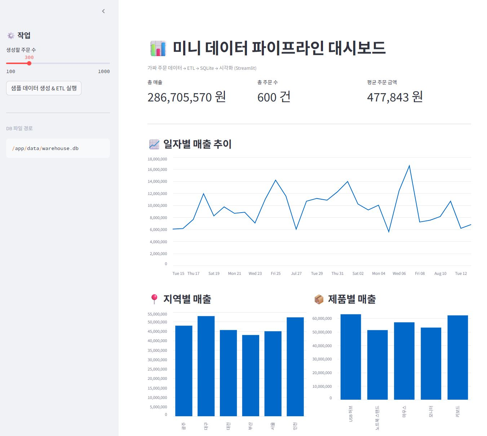

# 📊 Mini Data Pipeline Project
가짜 주문 데이터 → ETL → 데이터베이스 적재 → API → 대시보드 시각화
**Docker + GitHub Actions + Docker Hub 자동 배포 파이프라인**

---

## 🚀 프로젝트 개요
이 프로젝트는 미니 파이프라인구축입니다.
로컬 개발부터 Docker 컨테이너화, GitHub Actions를 통한 Docker Hub 자동 배포까지 전 과정을 경험할 수 있습니다.

### 📌 핵심 기능
- **ETL 파이프라인**: 가짜 주문 데이터 생성 → 변환 → DB 적재
- **데이터베이스**: SQLite(기본) → PostgreSQL(확장)
- **대시보드**: Streamlit을 통한 매출/주문 시각화
- **API 서버**: FastAPI로 데이터 조회/ETL 트리거 제공
- **스케줄러**: 매일 09:00 자동 ETL 실행(APScheduler)
- **CI/CD**: GitHub Actions → Docker Hub 자동 빌드/푸시
- **컨테이너 오케스트레이션**: docker-compose로 전체 서비스 실행

---

## 🛠 기술 스택
| 영역             | 기술 |
|------------------|------|
| 언어             | Python 3.11 |
| 데이터 처리      | pandas |
| 대시보드         | Streamlit |
| API 서버         | FastAPI, Uvicorn |
| 데이터베이스     | SQLite, PostgreSQL |
| 배포/환경        | Docker, docker-compose |
| 스케줄링         | APScheduler |
| CI/CD            | GitHub Actions, Docker Hub |

---

## 📂 폴더 구조
```
mini-pipeline/
├─ app/
│  ├─ pipeline.py          # ETL 파이프라인
│  ├─ streamlit_app.py     # 대시보드
│  ├─ api.py               # FastAPI 서버
│  ├─ scheduler.py         # ETL 스케줄러
│  ├─ requirements.txt     # 의존성 목록
├─ data/                   # CSV/DB 저장 (볼륨 마운트)
├─ .env                    # 환경변수 설정
├─ Dockerfile              # 공용 베이스 이미지
├─ docker-compose.yml      # 서비스 오케스트레이션
├─ .github/workflows/      # GitHub Actions 워크플로우
│  └─ docker-image.yml
└─ README.md
```

---

## ⚙️ 실행 방법

### 1️⃣ 로컬 실행 (개발 단계)
```bash
# 의존성 설치
python3 -m pip install -r app/requirements.txt

# ETL 실행
python3 app/pipeline.py

# Streamlit 대시보드 실행
streamlit run app/streamlit_app.py
```
- 대시보드: http://localhost:8501

---

### 2️⃣ Docker 로컬 실행
```bash
# 빌드
docker build -t mini-pipeline:local .

# 실행
docker run --rm -p 8501:8501 -v $(pwd)/data:/app/data mini-pipeline:local
```

---

### 3️⃣ docker-compose (전체 서비스 실행)
```bash
docker compose build
docker compose up -d
```
- **대시보드**: http://localhost:8501
- **API**: http://localhost:8000/health

---

## 🔄 GitHub Actions → Docker Hub 자동 배포
1. **Docker Hub 리포지토리 생성**: `username/mini-pipeline`
2. GitHub 리포지토리 `Settings → Secrets and variables → Actions`에서 추가:
   - `DOCKERHUB_USERNAME`
   - `DOCKERHUB_TOKEN`
3. main 브랜치에 push 시 자동 빌드 & 푸시
4. 원격 서버에서 실행:
```bash
docker pull username/mini-pipeline:latest
docker compose up -d
```

---

## 📈 대시보드 미리보기


- 일자별 매출 추이
- 지역별/제품별 매출 분석
- 총 매출, 주문 수, 평균 주문 금액 KPI

---

## 📅 개발 일정 (7일 완성 플랜)
| Day | 작업 내용 |
|-----|-----------|
| 1일차 | ETL 파이프라인 (CSV → SQLite) |
| 2일차 | Streamlit 대시보드 |
| 3일차 | Dockerfile 작성 & 이미지 빌드 |
| 4일차 | GitHub 리포지토리 연동 |
| 5일차 | Docker Hub 설정 |
| 6일차 | GitHub Actions CI/CD 구축 |
| 7일차 | PostgreSQL + FastAPI + 스케줄러 + docker-compose 확장 |

---

## 💡 확장 아이디어
- Airflow/Dagster로 워크플로우 관리
- 데이터 품질 체크(Great Expectations)
- 클라우드 DB(RDS, Cloud SQL) 연결
- 사용자 인증이 있는 대시보드

---

## 👤 Author
- **GitHub**: [미니파이프라인](https://github.com/SH-coder-user/mini-pipeline)
- **Docker Hub**: [미니파이프라인](https://hub.docker.com/r/skadlf915/mini-pipeline)

---
✨ _데이터 엔지니어링의 핵심 흐름을, 로컬부터 클라우드 배포까지 한 번에 경험할 수 있는 학습용 프로젝트입니다._
